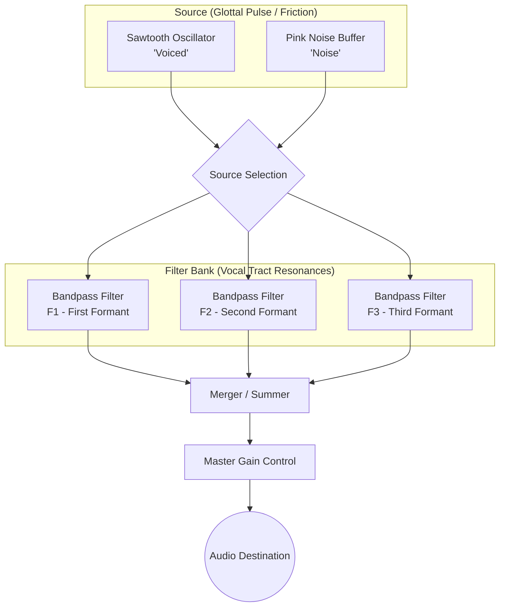

# Formant — Vocal Tract Synth

A real-time vowel synthesizer implemented with Vue 3 and the Web Audio API. This project simulates human vowel production by passing a raw source through a parallel bank of bandpass filters that represent the resonances (formants) of the vocal tract.

## Signal Processing Architecture

The synthesizer follows a classic source-filter model for speech synthesis.

### Components

1.  **Source Selection**: 
    *   **Voiced**: A sawtooth oscillator representing the periodic vibrations of the vocal folds.
    *   **Noise**: A pink noise source representing aspirated or unvoiced speech sounds.
2.  **Parallel Filter Bank**: Three `BiquadFilterNode` instances set to `bandpass` mode. Each filter represents a specific "formant" (resonant frequency).
    *   **F1**: Corresponds to vowel height (tongue position).
    *   **F2**: Corresponds to vowel backness.
    *   **F3**: Adds character and realism to the vocal timbre.
3.  **Visualization**: A real-time scrolling spectrogram displays the frequency response (0–4 kHz), illustrating how the formants shape the harmonic spectrum.

## Features

- **Vowel Space XY Pad**: Interact with a 2D mapping of F1 vs F2 frequencies.
- **Morphing**: Smoothly transition between vowel sounds by dragging across the space.
- **Vowel Presets**: Quick-access buttons for standard English vowels (FLEECE, KIT, FACE, etc.).
- **Real-time Spectrogram**: Visual feedback of the spectral peaks.
- **Formant Scaling**: Shift the entire vocal tract frequency range to simulate different tract lengths (e.g., child vs. adult).

## Usage

Simply open `index.html` in any modern web browser.
1. Click **▶ START** to initialize the Web Audio context.
2. Toggle between **VOICED** and **NOISE** modes.
3. Drag the cursor on the F1/F2 pad or use the sliders to shape the sound.
