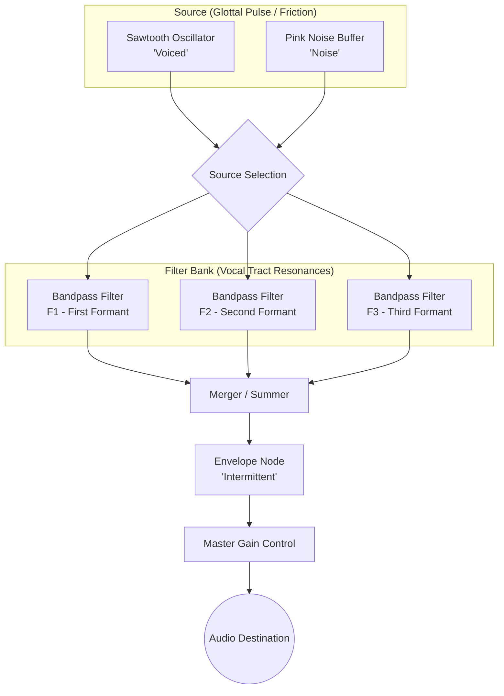

# FORMANTS — Vocal Tract Synth

A real-time vowel synthesizer implemented with Vue 3 and the Web Audio API. This project simulates human vowel production by passing a raw source through a parallel bank of bandpass filters that represent the resonances (formants) of the vocal tract.

## Signal Processing Architecture

The synthesizer follows a classic source-filter model for speech synthesis, with an added envelope stage for intermittent sound production.

### Components

1.  **Source Selection**: 
    *   **Voiced**: A sawtooth oscillator representing the periodic vibrations of the vocal folds.
    *   **Noise**: A pink noise source representing aspirated or unvoiced speech sounds.
2.  **Parallel Filter Bank**: Three `BiquadFilterNode` instances set to `bandpass` mode. Each filter represents a specific "formant" (resonant frequency).
    *   **F1**: Corresponds to vowel height (tongue position).
    *   **F2**: Corresponds to vowel backness.
    *   **F3**: Adds character and realism to the vocal timbre.
3.  **Envelope Stage**: A dedicated gain node handles the **Intermittent** mode, creating rhythmic pulses with adjustable Attack, Length, and Release.
4.  **Visualization**: A real-time scrolling spectrogram displays the frequency response (0–4 kHz). The visualization is synchronized with the envelope, only displaying spectral lines when the sound is audible.

## Features

- **Intermittent Mode (Default)**: Generates soft rhythmic pulses of sound.
- **Pulse Controls**: Fine-tune the rhythm with adjustable **Attack**, **Length**, **Release**, and **Pause** parameters.
- **Queued Vowel Selection**: In intermittent mode, selecting a vowel preset queues the change to occur exactly at the start of the next pulse (indicated by a dashed border).
- **Vowel Space XY Pad**: Interact with a 2D mapping of F1 vs F2 frequencies with larger, legible labels.
- **Morphing**: Smoothly transition between vowel sounds by dragging across the space.
- **Vowel Presets**: Quick-access buttons for standard English vowels with distinct, color-coded identifiers.
- **Real-time Spectrogram**: Visual feedback of the spectral peaks, now in a tighter, more compact format.
- **Formant Scaling**: Shift the entire vocal tract frequency range to simulate different tract lengths (e.g., child vs. adult).

## Usage

Simply open `index.html` in any modern web browser.
1. Click **▶ START** to initialize the Web Audio context.
2. Toggle between **CONTINUOUS** and **INTERMITTENT** modes.
3. Adjust **PULSE SETTINGS** to change the rhythm of the sound.
4. Use the **VOWEL PRESETS** or the **XY Pad** to explore different vocal qualities.
